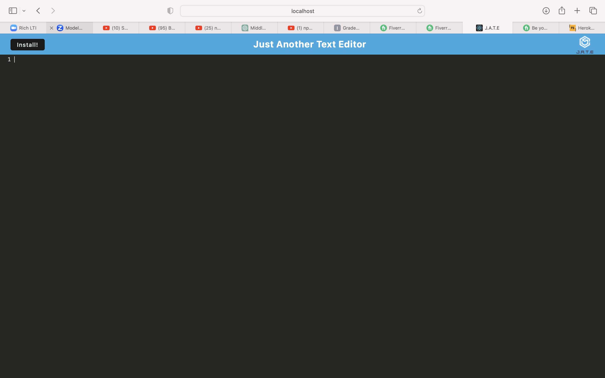

# Audrey-React-Portfolio

## Table of Contents
- [Description](#description)
- [Features](#features)
- [Demo](#demo)
- [Technologies Used](#technologies-used)
- [How to Use](#how-to-use)
- [Contact](#contact)
- [License](#license)

## Description

Build a text editor that runs in the browser. The app will be a single-page application that meets the PWA criteria. Additionally, it will feature a number of data persistence techniques that serve as redundancy in case one of the options is not supported by the browser. The application will also function offline.


## Preview




## Technologies Used

- IndexedDB database
- HTML
- Node.js
- Javascript


## How to Use

To run this portfolio locally or contribute to it, follow these steps:

1. Clone the repository:

   ```bash
   git clone git@github.com:audidi29/Audrey-React-Portfolio.git
   ```

2. Navigate to the project directory:

   ```bash
   cd Audrey-React-Portfolio
   ```

3. Install dependencies:

   ```bash
   npm install
   ```

4. Start the development server:

   ```bash
   npm start
   ```

5. Open your web browser and visit [http://localhost:3000/] to view the portfolio locally.

## Contact

- Email: laetitia.ama@gmail.com
- LinkedIn: [https://www.linkedin.com/in/laetitia-audrey-kacoutie-veh-879102ba/](#)
- GitHub: [https://github.com/audidi29/Audrey-React-Portfolio](#)

## License

This project is licensed under the [MIT License](LICENSE).
